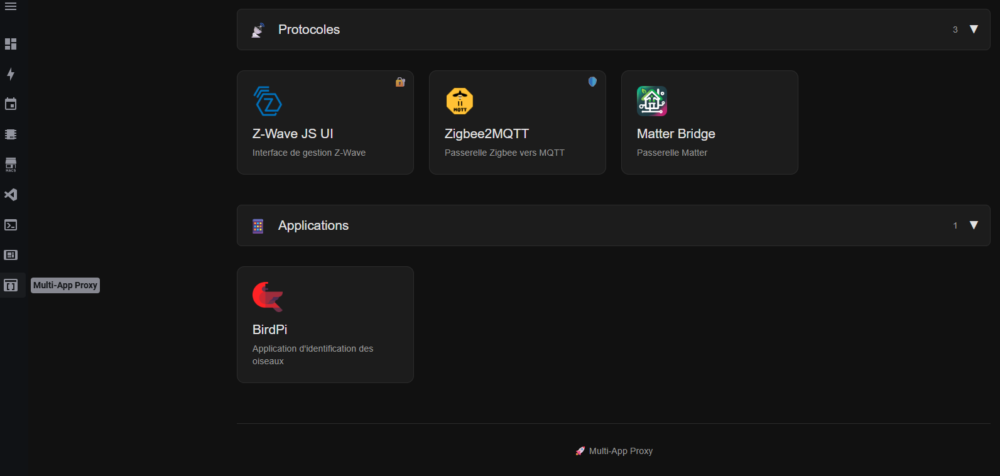

# 🚀 Multi-App Proxy
 

Simple and elegant reverse proxy for managing multiple web applications from Home Assistant.



### Features

- 🔀 Multi-application reverse proxy with categories
- 🔐 Token authentication (zigbee2mqtt-proxy compatible)
- 🔑 Secret/password protection per app (bcrypt-hashed, rate-limited)
- 👤 Admin-only app visibility
- 🎨 Modern interface with Home Assistant theme
- 📡 Native Home Assistant Ingress support
- 🌐 Full WebSocket support (Z-Wave JS UI, Zigbee2MQTT, Matter Bridge, etc.)
- 🔒 Self-signed SSL support
- 🐛 Debug mode with real-time logs
- 🖼️ Custom logos (emoji or image URL)

## Add repository

[](https://my.home-assistant.io/redirect/supervisor_add_addon_repository/?repository_url=https%3A%2F%2Fgithub.com%2FPulpyyyy%2Fmultiappproxy)

---

## 🎯 Overview

Multi-App Proxy is a Home Assistant add-on that allows accessing multiple web applications through a unified interface with native Ingress support.

### Features

- ✅ **Multi-application proxy** with elegant web interface
- ✅ **Custom categories** with automatic icons
- ✅ **Debug mode** with real-time logs
- ✅ **Token authentication** (zigbee2mqtt-proxy style)
- ✅ **Secret/password protection** per app (bcrypt, rate-limited)
- ✅ **Admin-only app visibility**
- ✅ **Auto-signed SSL support**
- ✅ **Full WebSocket support** (Z-Wave, Zigbee, Matter)
- ✅ **Custom logos** (emoji or image URL)
- ✅ **Native Ingress** Home Assistant
- ✅ **Home Assistant internal DNS**
- ✅ **YAML order preserved**

---

## 📦 Installation

### Method 1: Via GitHub Repository

1. In Home Assistant, go to **Settings** → **Add-ons** → **Add-on Store**

2. Click **⋮** (menu) at the top right → **Repositories**

3. Add the URL:
   ```
   https://github.com/Pulpyyyy/multiappproxy
   ```

4. Click **Add**

5. Refresh the page and install **Multi-App Proxy**

### Method 2: Manual Installation

1. Copy the `ha-addon` folder to `/addons/multiappproxy/`

2. Reload add-ons

3. Install **Multi-App Proxy**

---

## ⚙️ Configuration

### Minimal Configuration

```yaml
apps:
  - name: My Application
    url: http://192.168.1.100:8080
```

### Complete Configuration

```yaml
debug: true  # Enable real-time logs

apps:
  - name: Z-Wave JS UI
    url: http://192.168.1.123:8091
    description: Z-Wave management interface
    icon: ⚡
    logo: https://example.com/zwave-logo.png
    path: /zwavejsui
    rewrite: false
    category: Protocols

  - name: Zigbee2MQTT
    url: https://zigbee2mqtt.example.com:8080
    description: Zigbee to MQTT gateway
    icon: 🐝
    path: /z2m
    token: SuperSecretToken?
    rewrite: false
    category: Protocols

  - name: Matter Bridge
    url: http://matter-bridge.local:8283
    description: Matter gateway
    icon: 🌉
    logo: https://raw.githubusercontent.com/t0bst4r/matterbridge/main/frontend/public/matterbridge%2064x64.png
    path: /matter
    category: Protocols

  - name: Admin Dashboard
    url: http://192.168.1.50:9000
    path: /admin-dash
    admin: true           # Only visible to HA admin users
    secret: MyPassw0rd!   # Also requires a password
    category: Tools

  - name: NSPanel Manager
    url: http://192.168.1.60:8000
    path: /nspm
    csrf_fix: true        # Django app: align Origin/Host to pass CSRF check
    category: Automation

  - name: Home Assistant App (ingress-aware)
    url: http://192.168.1.70:8123
    path: /ha-app
    hassio_ingress_slug: my_other_addon  # resolve HA ingress token via Supervisor API
    category: Automation
```

---

## 📋 Detailed Parameters

### Global Parameters

| Parameter | Type | Default | Description |
|-----------|------|---------|-------------|
| `debug` | boolean | `false` | Enable real-time logs on interface and `error_log debug` in Nginx |

### Per-Application Parameters

| Parameter | Type | Required | Default | Description |
|-----------|------|----------|---------|-------------|
| `name` | string | ✅ Yes | - | Display name on card |
| `url` | string | ✅ Yes | - | Backend application URL (http/https) |
| `path` | string | No | `/app-name` | Access path in proxy |
| `description` | string | No | `""` | Description shown under name |
| `icon` | string | No | 📱 | Emoji to display (UTF-8) |
| `logo` | string | No | - | Image URL (takes priority over icon) |
| `category` | string | No | `Others` | Grouping category |
| `admin` | boolean | No | `false` | Show this app only to HA admin users |
| `secret` | string | No | - | Require a password to access the app (bcrypt-hashed server-side) |
| `token` | string | No | - | Authentication token (added as query string) |
| `rewrite` | boolean | No | auto | Force/disable full URL rewriting (auto-detected for Z-Wave/Zigbee by default) |
| `preserve_path` | boolean | No | `false` | Forward requests without stripping the path prefix (HA ingress-aware apps) |
| `csrf_fix` | boolean | No | `false` | Override `Origin` and `Host` with upstream URL (fixes Django CSRF check) |
| `ws_rewrite` | boolean | No | `false` | Inject a JS patch to rewrite WebSocket URLs through the proxy |
| `hassio_ingress_slug` | string | No | - | HA addon slug; resolves the ingress token path dynamically via Supervisor API |

### Categories and Icons

The following categories have automatic icons:

| Category | Icon | Usage |
|----------|------|-------|
| `Automation` | 🏠 | Home automation applications |
| `Protocol` or `Protocols` | 📡 | Z-Wave, Zigbee, Matter |
| `Media` | 🎥 | Plex, Jellyfin, etc. |
| `Tools` | 🔧 | Utilities |
| `Network` | 🌐 | Network tools |
| `Security` | 🔒 | Cameras, alarms |
| `Others` | 📱 | Default |

### URL Format

- ✅ `http://192.168.1.100:8080`
- ✅ `https://app.domain.com:8443`
- ✅ `http://hostname.local:3000`
- ❌ No trailing slash
- ❌ No path in URL

### Path Format

- ✅ `/myapp` (no trailing slash)
- ❌ `/myapp/` (with trailing slash)
- ❌ `/my/long/path` (no sub-paths)

### Token Authentication

The token is automatically added as a query string:

```yaml
token: MySecretToken123
```

Generates: `http://backend/?token=MySecretToken123`

**Special characters**: Automatically URL-encoded
- `?` → `%3F`
- `&` → `%26`
- `=` → `%3D`

### Secret / Password Protection

Protect an app with a password that the user must enter before accessing it:

```yaml
- name: Sensitive App
  url: http://192.168.1.100:8080
  path: /sensitive
  secret: MyStrongPassword
```

- The plain secret is **never stored or sent to the client** — only a bcrypt hash is kept server-side.
- Verification is rate-limited to **5 attempts/minute per IP** (burst 3).
- The `/api/verify-secret` endpoint handles the check.

### Admin-only Visibility

Hide an app from non-admin HA users:

```yaml
- name: Admin Panel
  url: http://192.168.1.100:9000
  admin: true
```

The app card is not rendered at all for non-admin users. It can be combined with `secret` for double protection.

### CSRF Fix (Django apps)

When proxying a Django application that enforces CSRF origin checks, set `csrf_fix: true`:

```yaml
- name: NSPanel Manager
  url: http://192.168.1.60:8000
  csrf_fix: true
```

This overrides the `Origin` and `Host` headers sent to the upstream so both match the upstream address, which satisfies Django's CSRF middleware without requiring `CSRF_TRUSTED_ORIGINS` on the upstream app.

### WebSocket Rewrite (`ws_rewrite`)

For apps that build WebSocket URLs client-side using `window.location.host` (which would bypass the proxy), inject a transparent JS patch:

```yaml
- name: MQTT Explorer
  url: http://192.168.1.100:4000
  ws_rewrite: true
```

A small `<script>` is injected before `</body>` that patches `window.WebSocket` to route `/websocket/` and `/wss?/` paths through the proxy location.

### Preserve Path (`preserve_path`)

For apps that are themselves HA-ingress-aware and already embed the full path in their URLs:

```yaml
- name: Ingress-aware App
  url: http://192.168.1.100:8080
  preserve_path: true
```

Requests are forwarded **as-is** (no prefix stripping, no `sub_filter` rewriting).

### HA Ingress Slug (`hassio_ingress_slug`)

For HA addons whose HTML already contains absolute paths prefixed with their own HA ingress token, specify the addon slug and multiappproxy will resolve the token dynamically via the Supervisor API and replace it with its own proxy path:

```yaml
- name: Other HA Addon
  url: http://192.168.1.100:8080
  hassio_ingress_slug: my_other_addon
```

Requires `SUPERVISOR_TOKEN` to be available (automatically set by HA).

---

## 🔧 Supported Applications

### ✅ Tested and Validated

#### Z-Wave JS UI
```yaml
- name: Z-Wave JS UI
  url: https://zwavejs.yourdomain.com:8091
  icon: ⚡
  path: /zwavejsui
  category: Protocols
```

**Notes:**
- Full WebSocket support
- Self-signed SSL supported
- No special configuration required

#### Zigbee2MQTT
```yaml
- name: Zigbee2MQTT
  url: http://zigbee2mqtt.local:8080
  icon: 🐝
  path: /z2m
  token: YourToken
  category: Protocols
```

**Zigbee2MQTT configuration required:**
```yaml
# In Zigbee2MQTT configuration.yaml
frontend:
  url: /z2m
```

**Notes:**
- Token automatically managed
- `frontend.url` configuration mandatory
- Compatible with official zigbee2mqtt-proxy logic

#### Matter Bridge
```yaml
- name: Matter Bridge
  url: http://matter-bridge.local:8283
  icon: 🌉
  path: /matter
  category: Protocols
```

### ⚙️ Other Applications

Any standard web application will work. Examples:

- **Portainer**: `http://portainer:9000`
- **Grafana**: `http://grafana:3000`
- **Node-RED**: `http://nodered:1880`
- **ESPHome**: `http://esphome:6052`

---

## 🛠 Troubleshooting

### Logs not displaying

**Solution:** Enable debug mode
```yaml
debug: true
```

### Application unreachable (404)

**Possible causes:**
1. Incorrect backend URL
2. Application not started
3. DNS issue

**Verification:**
```bash
# From the add-on terminal
curl -I http://your-app:8080
```

### Error 301 in loop

**Cause:** Application not configured for sub-path

**Solution for Zigbee2MQTT:**
```yaml
# In Zigbee2MQTT configuration.yaml
frontend:
  url: /z2m
```

### Token not transmitted

**Verification:**
```yaml
debug: true  # Enable logs
```

Look in logs for: `Token encoded: XXX... → YYY...`

**Nginx logs:** Enable debug to see full requests

### Self-signed SSL refused

**Solution:** Already handled automatically by add-on
```nginx
proxy_ssl_verify off;
proxy_ssl_server_name on;
```

### WebSocket not working

**Verification:** WebSocket headers are automatic
```nginx
proxy_set_header Upgrade $http_upgrade;
proxy_set_header Connection "upgrade";
```

If issue persists, check backend URL.

---

## 🗂 Technical Architecture

### Stack

- **Nginx 1.28.2**: Reverse proxy
- **Python 3**: Configuration scripts
- **S6-overlay**: Service supervision

### Request Flow

```
Home Assistant Ingress
         ↓
/api/hassio_ingress/XXX/
         ↓
    Nginx (port 8099)
         ↓
    Backend Applications
```

### Configuration Generation

1. **Home Assistant** → `/data/options.json`
2. **sync_config.py** → YAML ↔ JSON sync
3. **json_to_yaml.py** → `/app/config.yml`
4. **generate_config.py** → `/etc/nginx/nginx.conf` + `/app/apps.json`
5. **index.html** → Loads `apps.json` and displays interface

### Internal DNS

Automatic resolver on Home Assistant Supervisor DNS:
```nginx
resolver 172.30.32.3 valid=10s;
```

Allows using:
- `http://addon-name.local`
- `http://hostname.local`
- `http://192.168.1.X`

### Security ACL

Only Home Assistant Supervisor can access:
```nginx
allow 172.30.32.2;
deny all;
```

### Ingress Mode

Automatic detection via `$INGRESS_ENTRY`:
- Interface detects the basePath
- Nginx configures locations correctly
- No manual configuration needed

---

## 📝 Configuration Files

### Structure

```
/addon_configs/
└── xxxxx_multiappproxy/
    └── multi-app-proxy.yaml  # Config saved automatically
```

### Manual Editing

You can edit `multi-app-proxy.yaml` directly:

1. Edit the file
2. Restart the add-on
3. Config will sync automatically

---

## 🔐 Security

### Token Authentication

- Automatically URL-encoded
- Added as query string (`?token=XXX` or `&token=XXX`)
- Never exposed in logs (truncated)

### Security Headers

```nginx
add_header Cache-Control "no-store, no-cache, must-revalidate";
add_header Pragma "no-cache";
add_header Expires 0;
```

### SSL/TLS

- HTTPS backends support
- Self-signed certificates accepted
- No strict validation

---

## 🎨 Customization

### Custom Logos

**Via emoji:**
```yaml
icon: 🐝
```

**Via image URL:**
```yaml
logo: https://example.com/logo.png
```

**Priority:** `logo` > `icon` > default (📱)

**Automatic fallback:** If logo fails to load, icon displays

### Display Order

Applications display **in YAML declaration order**.

Categories appear in order of the **first app** in each category.

---

## 📊 Logs and Debug

### Debug Mode

```yaml
debug: true
```

**Effects:**
- Shows logs on web interface
- Enables `error_log debug` in Nginx
- Detailed configuration generation logs

### Viewing Logs

**Web interface:**
- Visible at top of page if `debug: true`
- Real-time logs during loading

**Add-on logs:**
- Home Assistant → Add-ons → Multi-App Proxy → Logs

**Nginx logs:**
```bash
# From add-on terminal
tail -f /var/log/nginx/access.log
tail -f /var/log/nginx/error.log
```

---

## 🆘 Support

### Known Issues

1. **Double slash in URL**: Fixed in v1.0.4
2. **App order**: Preserved since v1.0.4
3. **Token with special characters**: Automatically URL-encoded

### Report a Bug

GitHub Issues: https://github.com/Pulpyyyy/multiappproxy/issues

**Information to provide:**
- Add-on version
- Logs with `debug: true`
- Anonymized configuration
- Application concerned

---

## 📜 Changelog

### v1.0.4 (2026-02-08)
- ✅ YAML order preserved
- ✅ Debug mode with UI logs
- ✅ Custom logo support
- ✅ Material Design icon
- ✅ Complete documentation

### v1.0.3
- ✅ Trailing slash fix
- ✅ Token URL-encoding
- ✅ Collapsible categories

### v1.0.2
- ✅ Native Ingress support
- ✅ Auto-signed SSL
- ✅ Full WebSocket support

### v1.0.1
- ✅ Initial version

---

## 📄 License

MIT License

---

## 🙏 Credits

- Inspired by [zigbee2mqtt-proxy](https://github.com/zigbee2mqtt/hassio-zigbee2mqtt/tree/master/zigbee2mqtt-proxy)
- Material Design icons: https://materialdesignicons.com
- Home Assistant community

---

**Maintained by:** [@Pulpyyyy](https://github.com/Pulpyyyy)
